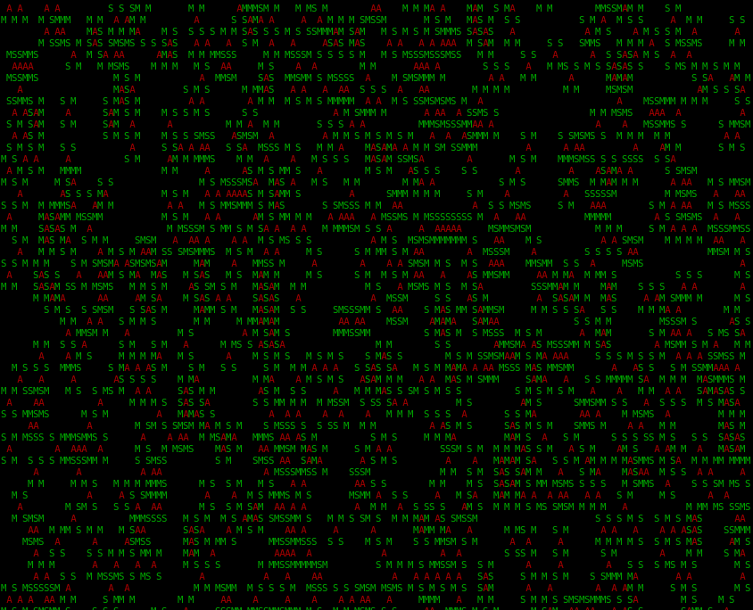

# AoC
Advent of Code problems to solve in various languages.


## Merry



Reference from day 4 puzzle

## General instructions

The txt input file must be created inside the folder of the language to solve the puzzle from.
Except for the SQL case, as stated in the [SQL section](#sql).


## Legend (by date invented)

- [Batch (1950)/Wine (1993)](#batch)
- [SQL (1970)](#sql)
- [Shell (1989)](#shell)
- [C (1970)](#c)
- [C++ (1979)](#c-1)
- [Python (1991)](#python)
- [Java (1991)](#java)
- [JavaScript (1995)](#javascript)
- [PHP (1995)](#php)
- [CSS/SASS (1996 / 2006)](#css-sass)
- [VBScript (1996)](#vbscript)
- [C# (2000)](#c-2)
- [Powershell (2006)](#powershell)
- [Godot (January 14 2014)](#godot)


## Batch

To execute the batch solution, navigate to the "Batch" folder of the desired day and open a terminal.
Then type the following command:

```batch
<solution>.bat
```

Replace ```<solution>``` with the solution file you want to execute and the result will be printed on screen.

All nice and easy, exept it requires a Windows OS which might be an issue for most people after October 14 2025...
Alternativly, you can use a Linux OS and install [wine](https://github.com/wine-mirror/wine) on it to enumate a Windows DOS environment.
For reference, I followed this [YouTube tutorial](https://www.youtube.com/watch?v=UCuD5myL6Fc) to install wine, but feel free to chose the installation process you are most confortable with.

Once wine is installed, navigate to the "Batch" folder of the desired day and open a terminal.
Then type ```wine cmd```
After some time, the terminal will be ready to accept commands.

Finally, follow the istructions given at the beginning and the script will execute.

**WARNING:**
Some solutions are extremly INefficient...
If you are doing this on a raspberry pi3, bring yourself some entertainment since it will take MINUTES to complete.


## SQL

A fex things before the instructions on how to execute sql solutions:
- Tables with prefix '_' are temporary tables;
- This solution requires sqlite3 installed.\
    Verify the installation with this [command](#check-version)\
    sqlite3 version 3.8.3 or higher is required for CTE support.

After checking all the above, you are ready to go:

### Instructions

1. Create a .db file inside the "SQL" folder like ```<db_file_name>.db```

2. Edit the ```createData.sql``` file and replace the ```<puzzle_input>``` string in single quotes.

3. [Execute](#execute-query-inside-the-database) the ```createData.sql``` query.

4. [Execute](#execute-query-inside-the-database) the ```part1Solution.sql``` query.

### Sqlite3 functions

### CTE

Basically a while loop...

Example:

```sql
--Param declaration
WITH CTE(iteration, count) AS (
    SELECT 1, 0--Setting initial param values
    --iteration = 1
    --count = 0

    UNION ALL--Body og the while loop

    SELECT iteration + 1,

        CASE--If statement
            WHEN SUBSTRING(INPUT_DAYX.Input, Iteration + 1, 1) = CHAR(10) THEN
                count + 1
            ELSE count
        END

    FROM CTE, INPUT_DAYX
    WHERE Iteration < LENGTH(INPUT_DAYX.Input)--Same condition inside the while loop

)
--So something with the result of the while iteration
SELECT 
    RowCount
FROM CTE
ORDER BY RowCount DESC
LIMIT 1;
```

```py
#Data inside the SQL table
input_dayx = "input_here"

#Param declaration in the CTE expression
iteration = 1
count = 0

#Code after the UNION ALL of the CTE.
while iteration < len(input_dayx):#The while condition is the same as the WHERE clause
    iteration += 1

    if "\n" in input_dayx:#Case statement
        count += 1
    else:
        count = count

#So something with the result of the while iteration
print(count)
```

### SUBSTRING

Syntax: SUBSTRING(string, start, length)

For a given string, it gets a substring of length {length} starting from index {start}.

### LENGTH

Syntax: LENGTH(string)

Returns the LENGTH of the passed string.

### INSTR

Syntax: INSTR(string, substring)

Searches for a substring within a string and returns the integer position of the first occurrence of that substring.

### sqlite3 commands

#### Check version
```sh
$ sqlite3 --version
```

#### Connect to lcoal .db file
```sh
$ sqlite3 <file_name>.db
sqlite>
```

#### Execute query from outside the database
```sh
$ sqlite3 <file_name>.db < part1Solution.sql
```

#### Quit sqlite3 session
```sh
sqlite> .quit
$ 
```


## Shell

Shell scripts solutions do not come ready to be executed;
They have to be manually set as executables.

To do so, navigate to the "Shell" folder of the desired day.
Open a terminal and type the following command:

```sh
chmod +x <solution>.sh
```

Finally, execute the script by typing the following command:

```sh
./<solution>.sh
```

Make sure to replace ```<solution>``` with the desired solution part file of the day.

## C

Compilation and execution of the C solution was made in Linux.
To compile the C program solutions, navigate to the C directory of the desired day and use the following syntax:

```sh
gcc <solution>.c -o <solution>.o && ./<solution>.o
```

### Example

```sh
gcc part2Solution.c -o part2Solution.o && ./part2Solution.o
```

## C++

Refer to the [C Solution](#c-solution), but instead of the gcc compiler use the g++ one.


## Python

### Installation

Make sure the Python interpeted is installed in your system.
In most Ubuntu based OS it is pre-installed by default, but on Windows it has to be installed manually.

### Solution

Navigate to the ```Python``` directory of the desired day and open a terminal.
Then type the following command:

```sh
python3 <file_name>.py
```

where the ```<file_name>``` is the wanted solution part.

## Java

### Installation

Make sure the Java interpeted is installed in your system.
In most Ubuntu based OS it is pre-installed by default, but on Windows it has to be installed manually.

Note:
There is no need to install the javac utility since just the java command is sufficient to execute these java scripts.

### Solution

Navigate to the ```Java``` directory of the desired day and open a terminal.
Then type the following command:

```sh
java <file_name>.java
```

where the ```<file_name>``` is the wanted solution part.

## JavaScript

Navigate to the ```JavaScript``` directory of the desired day and open a terminal.
Then type the following command:

```sh
node <file_name>.js
```

## PHP

Navigate to the ```Php``` directory of the desired day and open a terminal.
Then type the following command:

```sh
php -f <file_name>.php
```

## CSS (SASS)

### Pre-requisits

To compile SASS into CSS i found two ways:

1. Command line **(recomended)**:

    If you want to PERMANENTLY install this package, follow  the [Official SASS Installation guide](https://sass-lang.com/install/) to download the latest version of SASS for your operating system.
    At this point in time, its 1.91.0.

    How i did it was to TEMPORARLY install it by:
    - Downloading and extracting the zip package for my OS
    - Navigating to the desired day folder
    - Opening a terminal and typing the following command

    __Linux__

    ```sh
    export PATH=$PATH:{your_sass_package_location}
    ```

    __Windows__

    Save the executable file location in your environment variable.

    To verify if it works, open a terminal and type:

    ```sh
    sass --version
    ```

    The SASS version number should appear in the terminal.

    _**WARNING**_\
    _**For Linux users, If you decide to install temporarly this package, you need to re-execute the export command every time a new terminal shell is opened**_

1. Live Sass Compiler:
    Install ```Live Sass Compiler``` on Visual Studio Code and press the ```Watch Sass``` button when inside a sass file.

    **WARNING:**_\
    **This approch may take a significal amount of time before finishing**_


The next step is to format the input text in such a way that it stays in a single line.

To solve this, save your puzzle input text in a txt file and open a terminal in the same folder as the file resides.
If in Linux, type the following command:

```sh
tr '\n' '|' < {your_input_file}.txt > {output_file}.txt
```

It will take ```{your_input_file}.txt``` as a standard input data and apply the left-hand side operation, wich is replacing all newline characters with the pipe (|) one.

Finally it stores the output in ```{output_file}.txt``` file.

When the command finishes, open your ```{output_file}.txt``` and copy all its content.

Then, open the SASS file for the wanted day and replace ```<your_input>``` placeholder string with the copied one.

This operation is required since SASS does not support multi-line strings unless an escape ('\\') character is used at the end of each line.

Since that same character is removed in the generated CSS, it makes impossible to know where a new line starts and finishes.

### Solution

1. From command line **(recomended)**:

    Open a terminal in the wanted day and type the following command:

    ```sh
    sass {solution_file_name}.scss {solution_file_name}.css
    ```

    Replace {solution_file_name} with part1Solution or part2Solution based on which part you want to solve.

1. From Visual Studio Code:

    Open the SASS file for the wanted day and press the ```Watch Sass``` button.

Then open the ```results.html``` file and copy the result... wait its a colored box!!!.

To spice things up _**(and since this is a styling solution)**_ the returned color is the hexadecimal version of your solution.

Inspect the page and copy the color hexadecimal value, then convert it into decimal and voilà.


## VBScript

### Windows

Navigate to the "VBScript" folder of the wanted day and double click the problem part you want.

The final result will be stored in a .tmp file inside the current working directory.

### Linux

Wine is required for this solution to work.

Refer to the [Batch solution](#batch) for informations about how to install wine on Linux.

Once installed, navigate to the "VBScript" folder of the desired day and open a terminal.

Then type the following command:

```sh
wine wscript {solution_file}.vbs
```

Make sure to replace ```{solution_file}``` with the solution part you want to execute.

The final result will be stored in a .tmp file inside the current working directory.

## C#

Navigate to the ```CSharp``` directory of the desired day and open a terminal.
Then type the following command:

```sh
dotnet run
```

## Powershell

### Windows

Navigate to the desired day and open the "Powershell" folder inside it.
Then open a powershell terminal and type:

```powershell
.\{solutionScript}.ps1
```

Make sure to replcae ```{solutionScript}``` with the solution part file name you want.

### Linux

Linux needs pwsh to execute powershell scripts.

To achieve this, I followed this guide about [installing pwsh on a raspberry pi](https://pimylifeup.com/raspberry-pi-powershell/).

After the installation, everything described for Windows is the same.

**TIP**

If pwsh throws an error like ```No such file or directory```, try navigating to the folder where pwsh is installed and run .```/pwsh```


## Godot

Below procedures are made in Linux.
For more informations, check the [Official Godot Documentation](https://docs.godotengine.org/en/stable/tutorials/editor/command_line_tutorial.html)
The official godot engine executable for Linux is needed for this solution.
When downloaded, open a terminal in the directory where the executable is located and type the following commands:

```sh
#Copy the godot executable in the local bin folder where for easy access from anywhere.
#Replace <Godot_engine_name_and_version> with actual godot executable name.
sudo cp <Godot_engine_name_and_version> /usr/local/bin

#Navigate to the local bin folder.
cd /usr/local/bin

#Rename the executable with 'godot' (case-sensitive).
sudo mv <Godot_engine_name_and_version> godot
```

### Godot script execution

Navigate to the Godot directory of the desired day and open a terminal, then type the following command:

```sh
godot -s <file_name>.gd
```

### Example

```sh
godot -s part1Solution.gd
```


