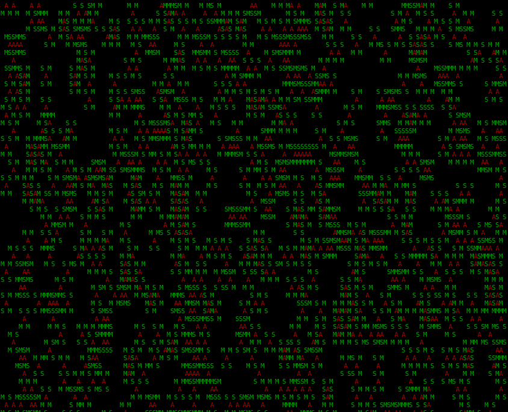

# AoC
Advent of Code problems to solve in various languages.


## Merry



Reference from day 4 puzzle


## SQL solution requirements

A fex things before the instructions on how to execute sql solutions:
- Tables with prefix '_' are temporary tables;
- This solution requires sqlite3 installed.\
    Verify the installation with this [command](#check-version)\
    sqlite3 version 3.8.3 or higher is required for CTE support.

After checking all the above, you are ready to go:

## Instructions

1. Create a .db file inside the "SQL" folder like ```<db_file_name>.db```

2. Edit the ```createData.sql``` file and paste the puzzle input between the single quotes

3. [Execute](#execute-query-inside-the-database) the ```createData.sql``` query.

4. [Execute](#execute-query-inside-the-database) the ```part1Solution.sql``` query.

## Sqlite3 functions

### CTE

Basically a while loop...

Example:

```sql
--Param declaration
WITH CTE(iteration, count) AS (
    SELECT 1, 0--Setting initial param values
    --iteration = 1
    --count = 0

    UNION ALL--Body og the while loop

    SELECT iteration + 1,

        CASE--If statement
            WHEN SUBSTRING(INPUT_DAYX.Input, Iteration + 1, 1) = CHAR(10) THEN
                count + 1
            ELSE count
        END

    FROM CTE, INPUT_DAYX
    WHERE Iteration < LENGTH(INPUT_DAYX.Input)--Same condition inside the while loop

)
--So something with the result of the while iteration
SELECT 
    RowCount
FROM CTE
ORDER BY RowCount DESC
LIMIT 1;
```

```py
#Data inside the SQL table
input_dayx = "input_here"

#Param declaration in the CTE expression
iteration = 1
count = 0

#Code after the UNION ALL of the CTE.
while iteration < len(input_dayx):#The while condition is the same as the WHERE clause
    iteration += 1

    if "\n" in input_dayx:#Case statement
        count += 1
    else:
        count = count

#So something with the result of the while iteration
print(count)
```

### SUBSTRING

Syntax: SUBSTRING(string, start, length)

For a given string, it gets a substring of length {length} starting from index {start}.

### LENGTH

Syntax: LENGTH(string)

Returns the LENGTH of the passed string.

### INSTR

Syntax: INSTR(string, substring)

Searches for a substring within a string and returns the integer position of the first occurrence of that substring.

## sqlite3 commands

### Check version
```sh
$ sqlite3 --version
```

### Connect to lcoal .db file
```sh
$ sqlite3 <file_name>.db
sqlite>
```

### Execute query from outside the database
```sh
$ sqlite3 <file_name>.db < part1Solution.sql
```

### Quit sqlite3 session
```sh
sqlite> .quit
$ 
```
